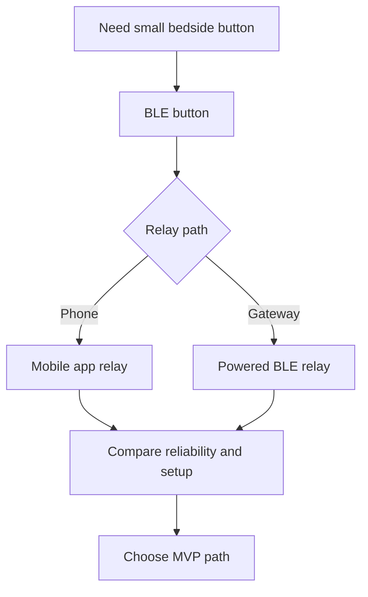

# Bad Dream Button Hardware Architecture

This folder captures the first-pass hardware and system architecture for the Bad Dream Button.

## Product Goal

Build a small bedside button that can be attached near a bed, run from a small battery where possible, and trigger a help request when pressed.

Default behavior:

- send an SMS to a configured phone number
- include the button name and a timestamp
- optionally place a phone call as part of escalation

## Core Requirements

- hand-buildable from off-the-shelf parts
- low power, with `CR2032` support as a preferred target
- wireless on the button via `BLE`
- configurable identity, recipient, and behavior
- simple bedside enclosure, with 3D printing as an acceptable path

## Current Recommendation

The selected first prototype path is:

- a `BLE` button built around a low-power radio MCU such as Nordic `nRF52` or Silicon Labs `EFR32BG22`
- a powered relay such as Raspberry Pi or another always-on `BLE` receiver that receives the button event and triggers SMS and optional voice through a cloud API

Why this is the leading option:

- it fits low-power expectations much better than direct `Wi-Fi` from a coin cell
- it avoids depending on mobile OS background behavior
- it keeps the bedside device small while offloading cloud work to powered hardware

## Files In This Folder

- `system-options.md`: architecture comparison for the selected `BLE` path and the remaining relay options
- `component-options.md`: candidate silicon, modules, and supporting hardware
- `power-budget.md`: battery and current draw constraints, especially around `CR2032`
- `prototype-paths.md`: concrete prototype directions and recommended MVP
- `pi3-sensehat-prototype.md`: powered prototype guide using a `Raspberry Pi 3` and `Sense HAT`
- `bom/`: early bill-of-materials drafts
- `enclosure/`: mounting and form-factor notes

## Decision Flow

## Next Step

Use these docs to choose the first prototype path before investing in firmware, backend services, or enclosure iterations.
